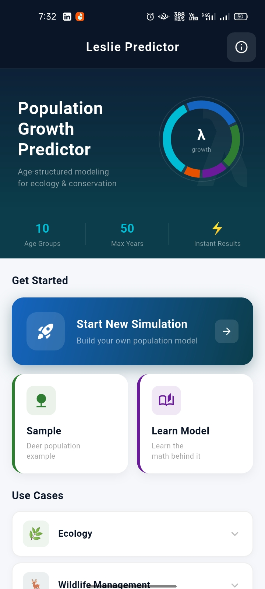
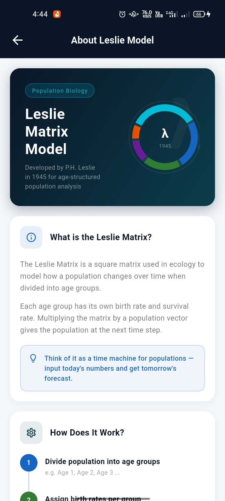
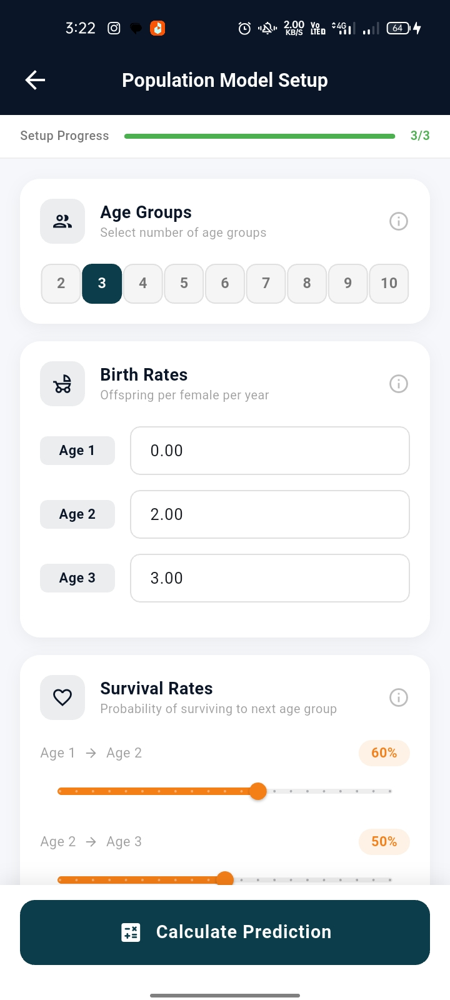
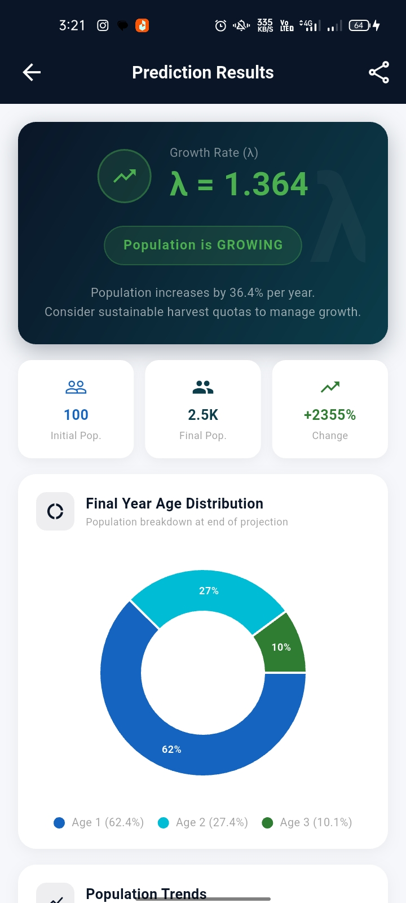
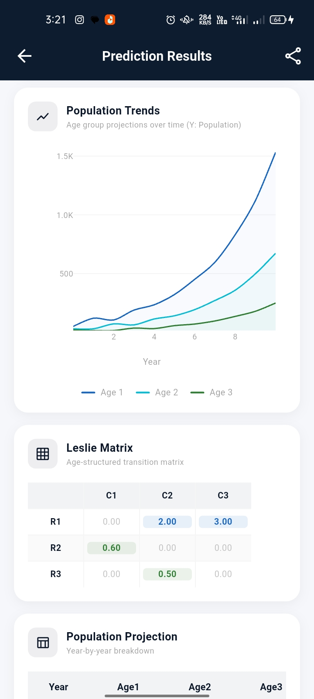
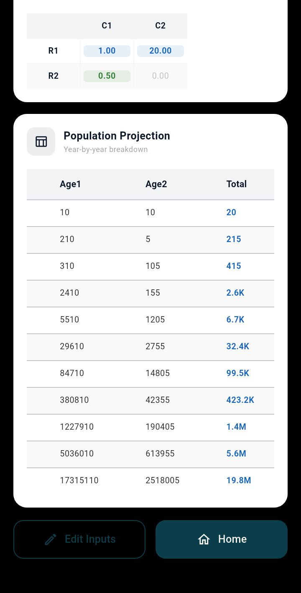
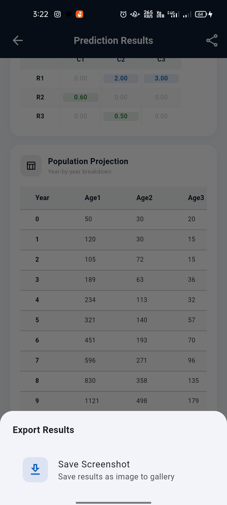

# 🦌 Leslie Predictor
### Age-Structured Population Growth Modeling App

> **2nd Semester Linear Algebra Project** — Department of Computer Science  
> Built as a unique application of matrix mathematics to real-world ecological modeling.

---

## 📖 Overview

**Leslie Predictor** is a Flutter mobile application that brings the **Leslie Matrix Model** — a foundational concept in linear algebra — to life. Instead of solving textbook problems, this app lets ecologists, students, and researchers model real animal population dynamics using age-structured matrix multiplication projected over time.

The Leslie matrix is a square matrix used in population ecology where each element represents **survival rates** and **fecundity (birth rates)** across age groups. By repeatedly multiplying this matrix against a population vector, we can predict how a population evolves year by year — a direct application of **eigenvalues, eigenvectors, and matrix powers** from linear algebra.

---

## 🧮 The Math Behind It

The core of the app is the **Leslie Matrix** **L**, defined as:

```
        [ f₁   f₂   f₃  ...  fₙ ]
        [ s₁   0    0   ...  0  ]
L  =    [ 0    s₂   0   ...  0  ]
        [ ...                   ]
        [ 0    0   sₙ₋₁ ...  0  ]
```

Where:
- **fᵢ** = fecundity rate (average offspring) of age group *i*
- **sᵢ** = survival probability of age group *i* to the next age class

### Population Projection

Given an initial population vector **n(t)**, the population at time **t+1** is:

```
n(t+1) = L · n(t)
```

After *k* years:

```
n(t+k) = Lᵏ · n(0)
```

### The Growth Rate λ (Lambda)

The **dominant eigenvalue λ** of the Leslie matrix determines long-term population behavior:

| λ value | Population Trend |
|---------|-----------------|
| λ > 1   | 📈 Growing      |
| λ = 1   | ➡️ Stable       |
| λ < 1   | 📉 Declining    |

This λ is displayed prominently in the app's animated donut chart on the home screen.

---

## 📱 Screenshots

<table>
  <tr>
    <td></td>
    <td></td>
    <td></td>
  </tr>
  <tr>
    <td></td>
    <td></td>
    <td></td>
  </tr>
  <tr>
    <td></td>
    <td></td>
    <td></td>
  </tr>
</table>

---

## ✨ Features

- **Custom Simulation** — Define up to 10 age groups with survival and fecundity rates
- **Sample Dataset** — Pre-loaded deer population example to get started instantly
- **λ Visualization** — Animated donut chart showing the dominant eigenvalue at a glance
- **Year-by-Year Projection** — Simulate population dynamics for up to 50 years
- **Population Charts** — Visual graphs showing growth/decline trends over time
- **Learn the Model** — Built-in explainer of the Leslie matrix math
- **Use Case Library** — Expandable tiles covering Ecology, Wildlife, Conservation & Research

---

## 🏗️ Project Structure

```
lib/
├── models/           # Data models (Leslie matrix, population vector)
├── screens/          # UI screens (Home, Input, Results, About)
├── viewmodels/       # Business logic & state (InputFormViewModel)
├── widgets/          # Reusable widgets (AnimatedDonut, charts)
└── main.dart         # App entry point & routing
```

---

## 🚀 Getting Started

### Prerequisites

- Flutter SDK ≥ 3.0.0
- Dart ≥ 3.0.0
- Android Studio / VS Code

### Installation

```bash
# Clone the repository
git clone https://github.com/itxmal03/leslie-population-predictor

# Navigate to project directory
cd leslie_predictor

# Install dependencies
flutter pub get

# Run the app
flutter run
```

---

## 📦 Dependencies

| Package | Purpose |
|---------|---------|
| `provider` | State management (MVVM pattern) |
| `url_launcher` | Email contact functionality |
| `fl_chart` *(or equivalent)* | Population growth charts |

---

## 🌿 Real-World Use Cases

| Domain | Application |
|--------|------------|
| 🌿 **Ecology** | Model how species shift across seasons and habitats |
| 🦌 **Wildlife Management** | Guide hunting quotas and breeding programs |
| 📊 **Conservation** | Predict extinction risk for endangered species |
| 🔬 **Research** | Standard tool in population biology publications |

---

## 🎓 Academic Context

This project was developed as part of the **2nd Semester Linear Algebra** course. The Leslie matrix model demonstrates:

- **Matrix multiplication** applied iteratively over time
- **Eigenvalue analysis** to determine long-term population fate
- **Vectors** representing age-structured population states
- **Linear transformations** modeling biological processes

Rather than submitting a conventional problem set, this project translates abstract matrix theory into a tangible tool with real ecological impact — bridging the gap between classroom mathematics and applied science.

---

## 👨‍💻 Developer

**Muhammad Aftab Liaqat**  
**Al-Najaf IT Solutions**  
📧 [najafdevs@gmail.com](mailto:najafdevs@gmail.com)

---

## 📄 License

This project is developed for academic purposes.  
© 2025 Al-Najaf IT Solutions. All rights reserved.